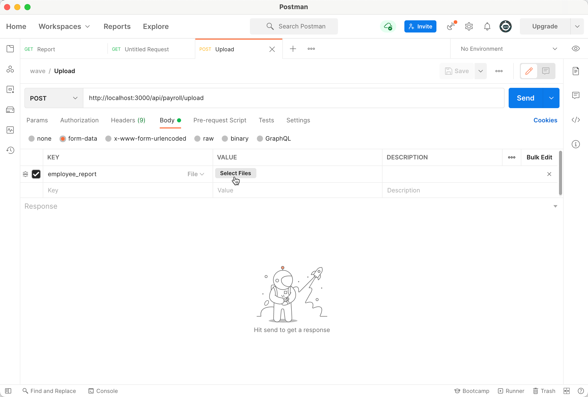
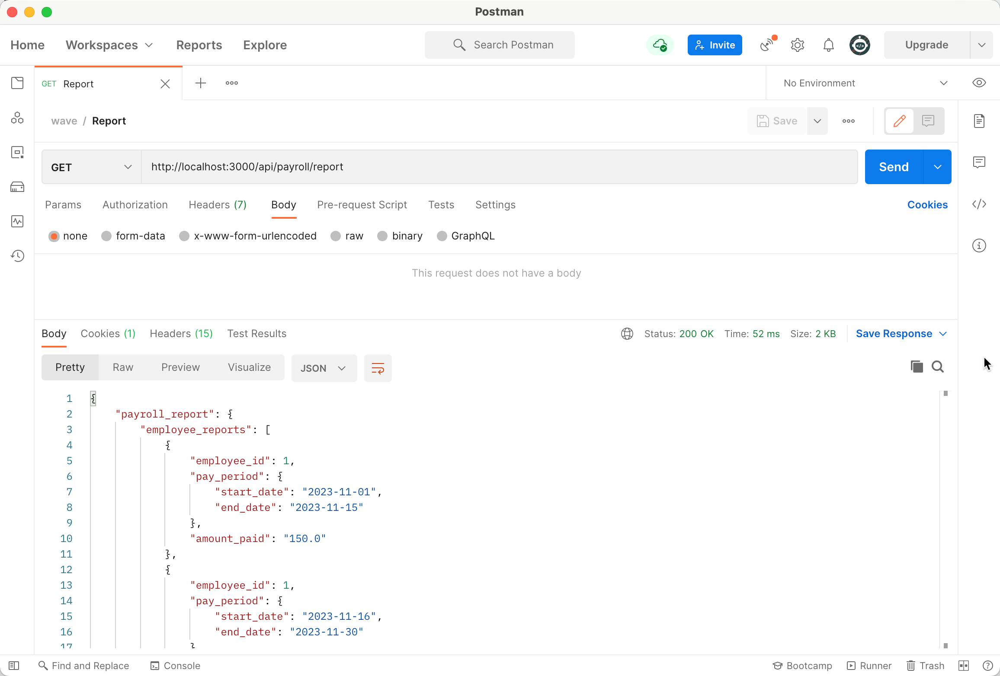

# Payroll

Payroll is a payroll system API written in Ruby on Rails, to be consumed by a single-page application. 

It supports two endpoints:

1. `/api/upload` : Upon a `POST` request containing the time report file, save the data in the file to a database. 
2. `/api/report` : Upon a `GET` request, returns a JSON response summarizing the payroll report.

### Software Used
* Ruby version: **3.0.0p0**
* Rails version: **6.1.4**
* Database: **Sqlite**
* How to run the test suite: `rails test`
* How to run the application: `rails server`

---
### Usage

To test the API, an API client such as [Postman](https://www.postman.com/downloads/) is recommended.

1. Start the server: `rails server`
2. To upload the time report. 
   1. Set method type to `POST`.
   2. Set the URL to [http://localhost:3000/api/payroll/upload](http://localhost:3000/api/payroll/upload)
   3. Select `File` from the drop-down under `Body > form-data`
   4. Select the time report file. 
   5. Click 'Send'.
    

3. To fetch the payroll report,
   1. Set method type to `GET`.
   2. Set the URL to: [http://localhost:3000/api/payroll/report](http://localhost:3000/api/payroll/report)
   3. Click 'Send'.
      

---

**How did you test that your implementation was correct?**

To ensure accuracy, I used the following approaches:
- Manually verified the results for a few simple time report files
- Added automated unit tests for all the model classes
- Added controller tests that perform end-to-end testing to verify the results

**If this application was destined for a production environment, what would you add or change?**

For a production environment, I would
- Perform thorough quality assurance testing.
- Review my code with other teammates as well as the QA team.
- Add more seed data and unit tests that cover the application logic for edge cases and boundary conditions.
- Test the `upload` endpoint with a few large time report files to ensure the API can process large files in a satisfactory amount of time, as well as the time taken to upload and build the report doesn't grow too much relative to the input file size.  
- Perform load testing to make sure the app doesn't crash under heavy traffic.
- Version the API, e.g. `/api/v1/upload`, to gracefully handle the future api changes.

**What compromises did you have to make as a result of the time constraints of this challenge?**

- Not having enough unit tests to test the boundary conditions.
- Not building a client that consumes the API and displays the results in a meaningful way.
- Not doing enough quality assurance, apart from basic testing.
- Not adding enough `rescue` clauses to handle unexpected errors. 

Note: I used [Jbuilder](https://github.com/rails/jbuilder) to convert the JSON response keys from snake_case to camelCase. However, it seems like it doesn't convert the keys more than two levels deep, even after enabling the `Jbuilder.deep_format_keys` setting. Hence, the `start_date` and `end_date` attributes are still in snake_case in the response. 

